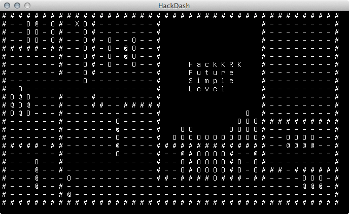

#HackDash
HackDash is a Boulder Dash clone made for HackKRK #11.
##To run:
You're gonna need [Go](http://golang.org/) and [glfw](http://www.glfw.org/).  
Remember to ```go get hagerbot.com/rog``` and run with ```go run hackdash.go```.  
HF.
##Screen:

##License:
[MIT](http://opensource.org/licenses/MIT)